*English below*

# Participer aux frais d'hébergement et au développement du plugin
Le proxy permettant de gérer l'authentification auprès d'Enedis pour que le plugin Linky puisse récupérer les consommations / productions d'électricité, est hébergé sur un serveur dédié. Si vous le souhaitez, vous pouvez participer aux frais d'hébergement en cliquant sur le bouton ci-dessous.

[](https://www.paypal.com/cgi-bin/webscr?cmd=_s-xclick&hosted_button_id=7FJWZVDPXFTEG&source=url)

Si vous le souhaitez, vous pouvez également faire un don pour encourager le développement du plugin en cliquant sur le bouton ci-dessous.

[](https://www.paypal.com/cgi-bin/webscr?cmd=_donations&business=92UJFSAJTMBBL&item_name=Plugin+Domoticz+Linky+%28d%C3%A9veloppement%29&currency_code=EUR)

# Plugin Linky pour Domoticz
Ceci est un plugin pour [Domoticz](https://domoticz.com), récupérant les données Linky. Les données sont collectées du compte utilisateur [Enedis](http://www.enedis.fr) et stockées dans le log d'un dispositif compteur électrique.

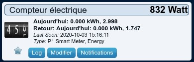

En cliquant sur le bouton "Log" :

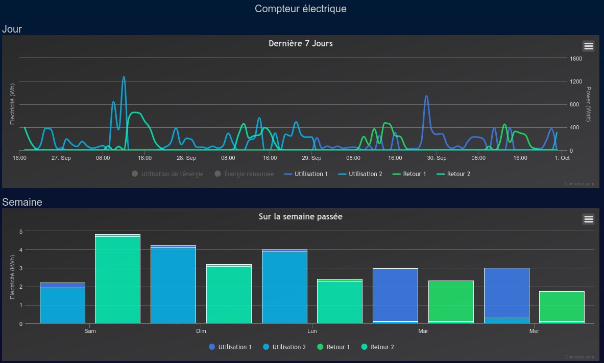

En cliquant sur le bouton "Rapport" :

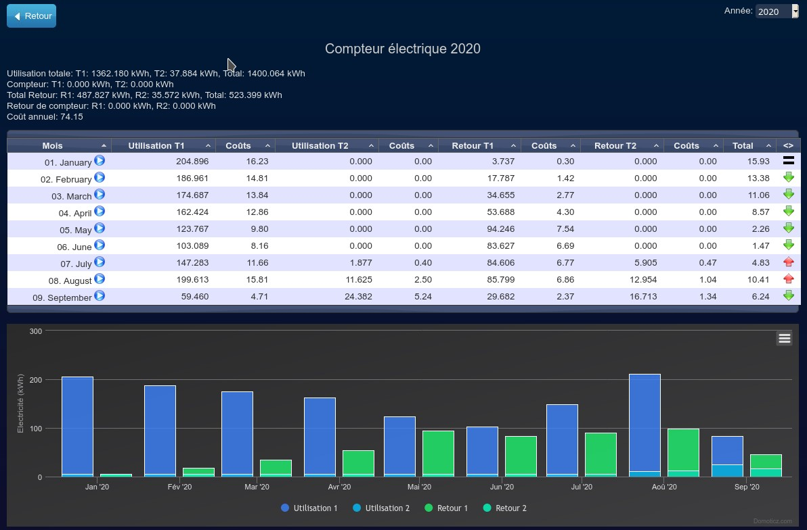

## Prérequis
La version de Domoticz doit être 4.11070 ou plus récente. La version de Domoticz doit être 4.11774, 2020.1 ou plus récente pour pouvoir visualiser l'énergie produite et la différentiation jour / nuit.

Le framework python 3 doit être installé, suivez le guide https://www.domoticz.com/wiki/Using_Python_plugins, en particulier faites attention à installer la version "dev" si vous ne voyez pas apparaître le plugin dans la liste dans l'onglet de configuration Configuration / Matériel après avoir redémarré Domoticz.

Vérifiez que sont activés les "Événements (Lua/Blockly/Scripts)" dans "Configuration / Paramètres / Autre" :

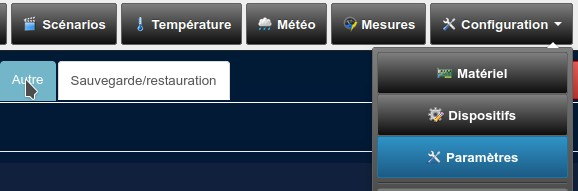

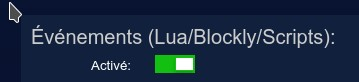

Vous devez avoir un compteur Linky, créer un compte utilisateur sur [Enedis](http://www.enedis.fr), accepter les conditions d'utilisation et vérifier que vous visualisez bien les courbes sur le site. En particulier, vérifiez la vue par heures (allez sur "Suivre les mesures" et passez "affiché(e)s en" sur "heures"), Enedis peut vous demander la permission la première fois pour collecter et enregistrer les données par heure, ce plugin ne fonctionnera pas pleinement si vous n'avez pas passé cette étape. Vous pouvez activer la collecte et l'enregistrement des données par heure sur votre compte Enedis sur "Gérer l'accès à mes données" dans l'encart "Collecte de la consommation horaire" et dans l'encart "Enregistrement de la consommation horaire". Les données peuvent ne pas être disponibles après l'installation ou l'activation de Linky, soyez patient et vérifiez que vous recevez les données sur le site [Enedis](http://www.enedis.fr) avant de rejetter la faute sur le plugin.

## Installation
Copiez plugin.py dans le sous-répertoire plugins/DomoticzLinky de Domoticz ou placez vous dans le sous répertoire plugins de Domoticz and tapez la commande suivante :
```
git clone https://github.com/guillaumezin/DomoticzLinky
```

Pour mettre à jour, écrasez plugin.py ou placez vous dans le sous répertoire plugins de Domoticz et tapez la commande suivante :
```
git pull
```

Redémarrez Domoticz.

Si vous ne recevez pas de données ou obtenez des valeurs incohérentes, en particulier après une mise à jour, revérifiez que sont activés l'enregistrement et la collecte de la consommation horaire sur votre compte Enedis sur "Gérer l'accès à mes données" dans l'encart "Enregistrement de la consommation horaire" et dans l'encart "Collecte de la consommation horaire" et attendez 2 jours.

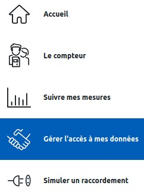

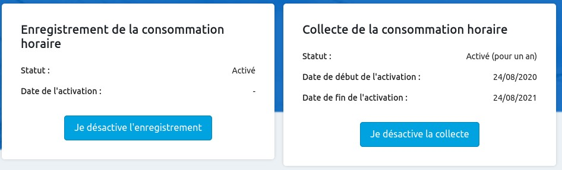

Si après ça, ce n'est toujours pas bon, il faut effacer le dispositif, et relancer le plugin en cliquant sur le matériel Linky dans les paramètres et en cliquant sur "Modifier", ou relancer Domoticz.

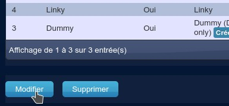

Quand on efface le dispositif ou qu'on met à jour de la version 1 à la version 2 du plugin, on perd l'historique, qu'il est possible de retélécharger sur 730 jours max (en modifiant le paramètre "Nombre de jours à récupérer pour les autres vues" du plugin). Lorsque vous avez récupéré l'historique, n'oubliez pas de redescendre le chiffre à 7 par exemple pour ne pas surcharger les serveurs d'Enedis. Le plugin version 2 ne sait pas récupérer l'historique d'un dispositif du plugin version 1, ce ne sont plus tout à fait les mêmes tables dans la base de données.

Si en récupérant les données, le plugin détecte un dispositif avec seulement des données de consommation, et un autre avec seulement des données de production, il créera un nouveau dispositif fusionnant les données pour faciliter la consultation.

## Configuration
A la première installation, commencez par vérifier dans les paramètres de Domoticz que "Accepter de nouveaux dispositifs matériels" est activé au moins temporairement (Configuration / Paramètres / Système / Matériel/dispositifs).

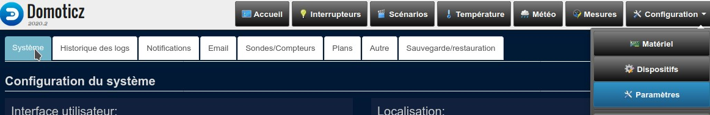

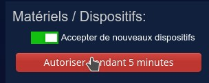

Ajoutez le matériel Linky dans l'onglet de configuration Configuration / Matériel.

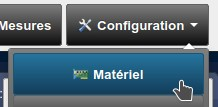

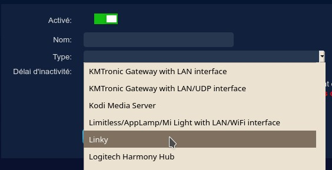

Vous pouvez configurer les tarifs heures pleines (Coûts T1 pour la consommation et R1 pour la production) et heures creuses (Coûts T2 pour la consommation et R2 pour la production) dans le menu Configuration / Paramètres / Sondes/Compteurs. Dans ce menu, vérifiez que "Electricité" est bien mis à 1000.

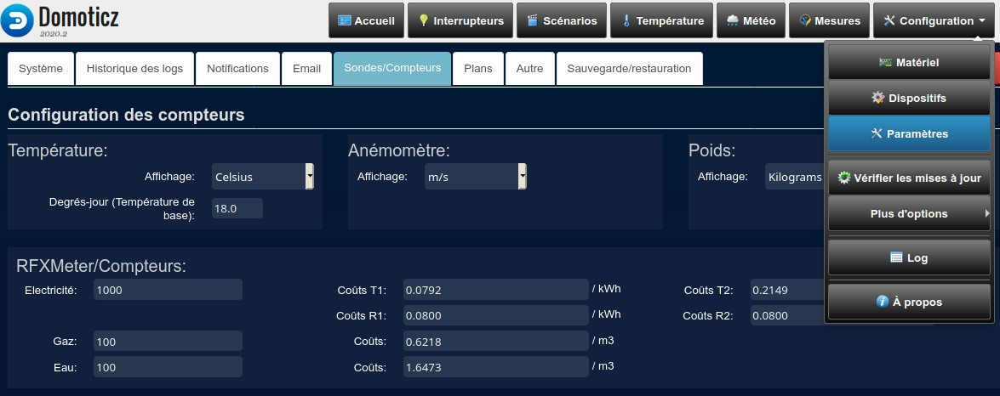

Dans ce même menu, en bas, vérifiez que "P1 Smart Meter" est bien de type "Avec des décimales".

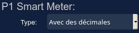

### Obtention du consentement
Commencez par surveiller l'onglet "Erreur" dans Configuration / Log. Aux premières connexions, le plugin doit vous donner l'adresse Web https://enedis.domoticz.russandol.pro/device à consulter et un code à y copier/coller pour obtenir le consentement du partage de données d'Enedis vers le plugin.

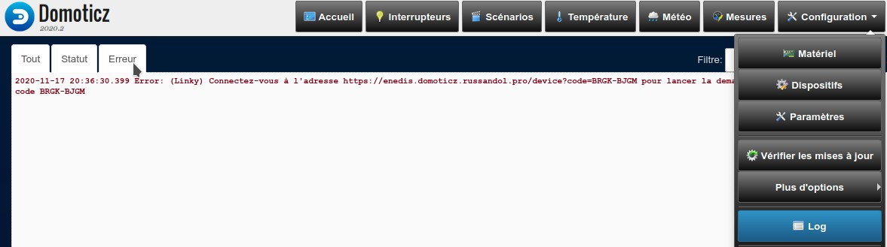

Si vous ne répondez pas dans les minutes qui suivent, le plugin est arrêté. Pour relancer le processus, rendez-vous dans Configuration / Matériel, cliquez sur le plugin et sur Modifier.


Après avoir activé le matériel et donné le consentement, vous devriez avoir un nouveau dispositif Linky dans l'onglet Mesures, et vous devriez pouvoir visualiser les courbes de consommation via le bouton Log de ce dispositif.

### Heures creuses
Vous pouvez remplir le champ "Heures creuses" pour choisir les plages horaires d'heures ("Utilisation 2" dans les courbes), ou laisser vide pour désactiver, voici des exemples :

```
2h00-7h00 13h00-16h00
```
configure les heures creuses de 2h à 7h et de 13h à 16h.

```
2h00-7h00 13h00-16h00 mercredi 08h00-15h00 samedi 09h00-11h00 12h00-16h00
```
configure les heures creuses de 8h à 15 le mercredi, de 9h à 11h et de 12h à 16h le samedi et de 2h à 7h et de 13h à 16h les autres jours de la semaine.

```
2h00-7h00 13h00-16h00 me 08h00-15h00 sa 09h00-16h00
```
configure les heures creuses de 8h à 15 le mercredi, de 9h à 16h le samedi et de 2h à 7h et de 13h à 16h les autres jours de la semaine.

```
12345678901234 1h00-6h00 12h00-14h00 88888888888888 13h00-16h00
```
configure les heures creuses pour les plages horaires "1h00-6h00 12h00-14h00" pour le point de livraison "12345678901234" et la plage horaire "13h00-16h00" pour le point de livraison "88888888888888".

```
02h00-04h00 16h00-19h00 12345678901234 1h00-6h00 12h00-14h00 mercredi 11h00-16h00 88888888888888 13h00-16h00
```
configure les heures creuses pour la plage horaire "11h00-16h00" le mercredi et "1h00-6h00 12h00-14h00" pour les autres jours de la semaine pour le point de livraison "12345678901234", la plage horaire "13h00-16h00" pour le point de livraison "88888888888888" et les plages horaires "02h00-04h00 16h00-19h00" pour tous les autres points de livraison.

```
02h00-04h00 16h00-19h00 12345678901234 88888888888888 13h00-16h00
```
désactive les heures creuses pour le point de livraison 12345678901234, configure les heures creuses pour la plage horaire "13h00-16h00" pour le point de livraison "88888888888888" et les plages horaires "02h00-04h00 16h00-19h00" pour tous les autres points de livraison.

```
02h00-04h00 16h00-19h00 P 17h00-22h00 mercredi 11h00-16h00 12345678901234 88888888888888 13h00-16h00
```
désactive les heures creuses pour le point de livraison 12345678901234, configure les heures creuses pour la plage horaire "13h00-16h00" pour le point de livraison "88888888888888" et les plages horaires "02h00-04h00 16h00-19h00" en consommation et "11h00-16h00" le mercredi et "17h00-22h00" pour les autres jours de la semaine en production pour tous les autres points de livraison.

```
02h00-04h00 16h00-19h00 P
```
configure les heures creuses pour les plages horaires "02h00-04h00 16h00-19h00" en consommation et désactive les heures creuses en production pour tous les points de livraison.

```
02h00-04h00 sa 00h00-23h59 di 00h00-23h59 fe 00h00-23h59
```
configure les heures creuses pour la plage horaire "02h00-04h00", pour le week-end et pour les jours fériés.

Pour appliquer les heures creuses aux anciennes données, passez le paramètre "Debug" à "Reset cache" et cliquez sur "Modifier", puis remettez "Debug" à son ancienne position et refaites "Modifier". 

### Affichage
Vous pouvez choisir le nombre à afficher sur le tableau de bord :


* sur la première ligne : il s'agit d'un pic de consommation instantané (Watt). Cette ligne correspond au paramètre "Consommation à montrer sur le tableau de bord (affichage principal)" du plugin

* sur les lignes suivantes : il s'agit d'une énergie consommée (kWh). La valeur "Aujourd'hui" qui précède reste à 0, c'est normal car Enedis ne fournit que la valeur de la veille. Ces lignes correspondent au paramètre "Consommation à montrer sur le tableau de bord (affichage secondaire)" du plugin. Ces lignes n'apparaîtront pas sur le tableau de bord principal (onglet Accueil), seulement dans l'onglet Mesures

### Nombre de jours à récupérer
* Vous pouvez choisir le nombre de jours à récupérer pour la vue par heures. Vous pouvez mettre le nombre de jours à récupérer à 0 pour désactiver la récupération de données pour la vue par heures. Notez que Domoticz effacera chaque jour une partie des données de la vue par heures en se basant sur le paramètre Log des capteurs qui se trouve dans Configuration / Paramètres / Historique des logs, vous pouvez augmenter ce paramètre pour voir jusqu'à 7 jours d'historique

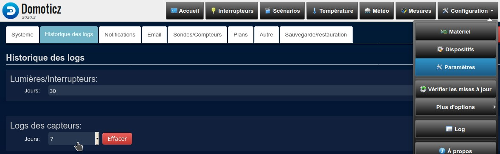

* Vous pouvez choisir le nombre de jours à récupérer pour les autres vues. Si la valeur est supérieur à 35, le plugin ne fera la récupération que de temps en temps ou quand le paramètre est modifié, pour ne pas surcharger les serveurs d'Enedis. Une fois les données récupérées, elles sont stockées et persistent dans la base de données de Domoticz

## Dépannage
### Etat des services
Commencez par consulter l'[état des services Enedis (API en production : Authorize et Metering Data v5)](https://datahub-enedis.fr/services-api/etat-des-services/). En cas d'erreur, le plugin ne pourra pas fonctionner non plus, il faudra attendre le rétablissement des services.

### Les courbes affichent les données en jour de la semaine, du mois et de l'année mais pas les données en heures
Vérifiez que vous avez bien suivi toutes les étapes du menu [Configuration](#configuration).

### Erreur "Données manquantes pour mettre à jour le tableau de bord"
Cette erreur est liée à des données manquantes pour satisfaire les configurations d'affichage "Consommation à montrer sur le tableau de bord". Cette erreur doit être transitoire. Si elle persiste plusieurs jours de suite, essayez de changer la configuration "Consommation à montrer sur le tableau de bord". Si cela persiste encore, ouvrez une demande de support.

### Erreur "Serveurs inaccessibles à cette heure"
Les serveurs d'Enedis sont inaccessibles la nuit, le plugin va de lui-même ré-essayer de récupérer vos données le lendemain matin après 8h.

### Erreur "Trop d'échecs de communication, le plugin réessaiera plus tard"
Cela traduit en général un problème de quota : Enedis offre au plugin un certains nombre d'appels possibles vers son site pour l'ensemble des utilisateurs du plugin. Le plugin va de lui-même ré-essayer de récupérer vos données l'heure suivante. Si vous rencontrez souvent cette erreur, il vaut mieux diminuer le paramètre "Nombre de jours à récupérer pour les autres vues" à 7 pour diminuer le nombre d'appels.

### Problèmes relatifs à l'obtention du consentement
Si vous avez des problèmes récurrents avec l'obtention du consentement, vous pouvez relancer l'étape en passant le paramètre "Debug" à "Reset consentement" et cliquez sur "Modifier", puis remettez "Debug" à son ancienne position et refaites "Modifier". Ensuite retournez lire le chapitre [Obtention du consentement](#obtention-du-consentement).

### Les problèmes persistent
Passez le paramètre "Debug" à "Simple" et cliquez sur "Modifier". Observez le log de Domoticz, il vous indiquera le chemin vers un fichier log spécifique au plugin, par exemple /tmp/DomoticzLinky_2021_01_17_15_04_19_ukzvik3k.log. Ouvrez ce fichier avec un éditeur de texte pour voir ce qui se trame. Si vous n'y comprenez rien, envoyez le fichier à l'adresse e-mail qui s'affiche sur https://github.com/guillaumezin (pour que l'adresse soit visible, il faut que vous ayez un compte github et que vous soyez connecté) et en parallèle ouvrez un ticket de support sur https://github.com/guillaumezin/DomoticzLinky/issues. N'essayez pas d'attachez le fichier log au ticket de support, ça ne passera pas.

## Auteurs
* **Baptiste Candellier** - *Kindle Linky plugin* - [linkindle](https://github.com/outadoc/linkindle)
* **Asdepique777** - *Jeedom Linky plugin* - [jeedom_linky](https://github.com/Asdepique777/jeedom_linky)
* **epierre** - *Linky external script for Domoticz* - [domoticz_linky](https://github.com/empierre/domoticz_linky)
* **Guillaume Zin** - *Portage vers le plugin framework de Domoticz et adaptation du code de Device Flow Proxy Server pour Enedis* - [DomoticzLinky](https://github.com/guillaumezin/DomoticzLinky) et [DomoticzFlowProxyServer](https://github.com/guillaumezin/Device-Flow-Proxy-Server)
* **Frédéric Caillet** - *Contractualisation, maintenance et hébergement du code de Device Flow Proxy Server pour Enedis* - [DomoticzFlowProxyServer](https://github.com/russandol-sarl/Device-Flow-Proxy-Server)

Vous pouvez aussi dans la liste des [contributeurs](https://github.com/guillaumezin/DomoticzLinky/contributors) qui a participé au projet.

## Licence
Ce projet est sous licence AGPLv3 - cf. fichier [LICENSE](LICENSE) pour plus de détails.

## Remerciements
* Frédéric Caillet - son site Internet : [RUSSANDOL](https://www.russandol.pro) - pour l'hébergement et la maintenance de l'infrastructure intermédiaire d'obtention du consentement oAuth et la prise en charge contractuelle avec Enedis
* Baptiste Candellier
* Asdepique777
* empierre
* Domoticz team

----------------------------------------------------------------

# Contribute to hosting costs and plugin development
The proxy used to manage authentication with Enedis so that the Linky plugin can grab electricity consumption / production data is hosted on a dedicated server. If you wish, you can participate in the accommodation costs by clicking on the button below.

[](https://www.paypal.com/cgi-bin/webscr?cmd=_s-xclick&hosted_button_id=7FJWZVDPXFTEG&source=url)

If you wish, you can also donate to encourage the development of the plugin by clicking on the button below.

[](https://www.paypal.com/cgi-bin/webscr?cmd=_donations&business=92UJFSAJTMBBL&item_name=Domoticz+Linky+plugin+%28development%29&currency_code=EUR)

# Linky plugin for Domoticz
This is a plugin for [Domoticz](https://domoticz.com), to grab data from french smartgrid meter Linky. It grabs data from [Enedis](http://www.enedis.fr) user account and store them inside a counter device log.

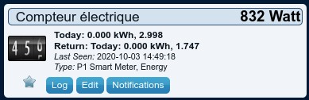

When clicking on "Log" button:

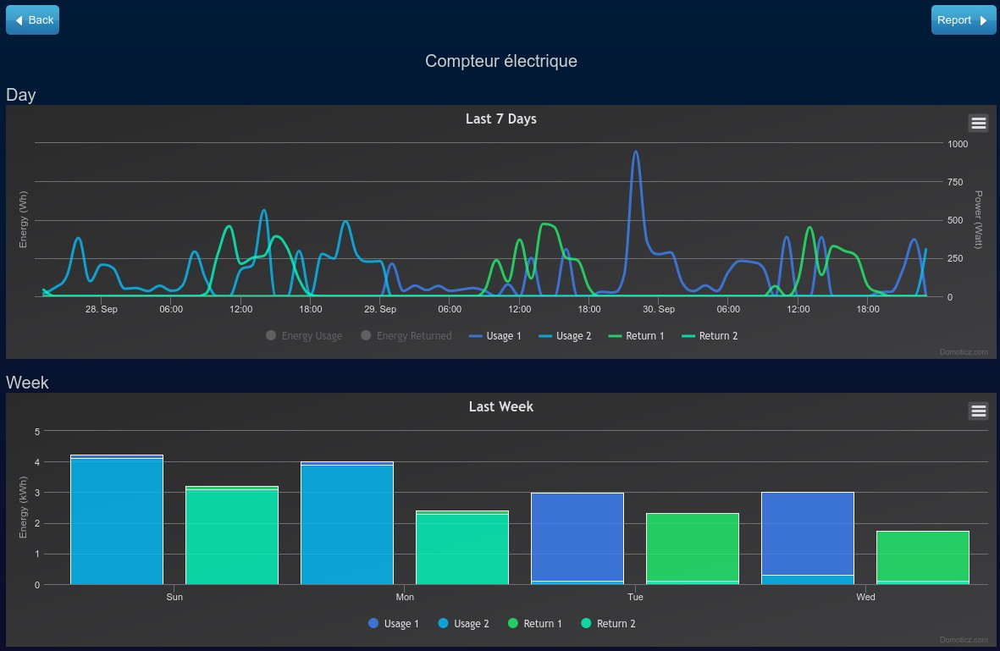

When clicking on "Report" button:

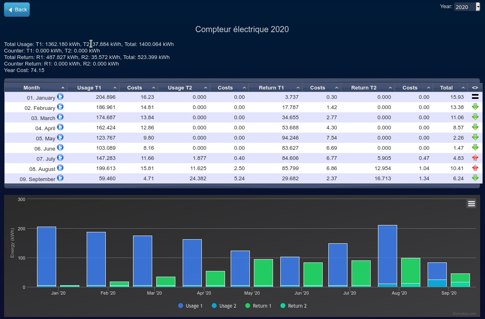

## Prerequisites
Domoticz version must be at least 4.11070. Domoticz version must be at least 4.11774 or 2020.1 to see energy production and day / night tariff differences.

The python 3 framework must be installed, follow the guide https://www.domoticz.com/wiki/Using_Python_plugins, in particular be careful to install the "dev" version if you do not see the plugin in the list in the Setup / Hardware configuration tab after restarting Domoticz.

Check that the "EventSystem (Lua/Blockly/Scripts)" is enabled in dans "Setup / Settings / Other" :

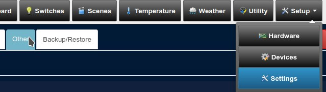


You need to have a Linky meter, create a user account on [Enedis](http://www.enedis.fr), accept conditions on the website and check that you receive data on the website. In particular, check the hour view (go to "Suivre les mesures" and switch "affiché(e)s en" to "heures"), Enedis might ask for your permission the first time to collect hours data, this plugin won't work if you didn't fulfill this step. You can activate the recording and collection of data per hour on your Enedis account on "Gérer l'accès à mes données" in "Enregistrement de la consommation horaire" area and in "Collecte de la consommation horaire" area. Data might be not available the first weeks after Linky has be installed or enabled, be patient and check you get data on [Enedis](http://www.enedis.fr) website before blaming the plugin.

## Installing
Copy the plugin.py to domoticz directory/plugins/DomoticzLinky or change directory to domoticz directory/plugins and issue the following command:
```
git clone https://github.com/guillaumezin/DomoticzLinky
```

To update, overwrite plugin.py or change directory to domoticz directory/plugins/DomoticzLinky and issue the following command:
```
git pull
```

Restart Domoticz.

If you do not receive any data or get inconsistent values, in particular after an update, double-check that the recording and collection of data per hour are enabled on your Enedis account on "Gérer l'accès à mes données" in "Enregistrement de la consommation horaire" area and in "Collecte de la consommation horaire" area and wait 2 days.


If after that, it is still not good, you have to delete the device, and restart the plugin by clicking on the Linky hardware in the settings and clicking on "Update", or restart Domoticz.

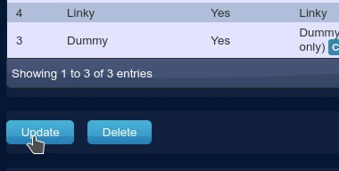

When the device is deleted or update the plugin from version 1 to version 2, the history is lost, which can be redownloaded over 730 days max (by modifying the parameter "Nombre de jours à récupérer pour les autres vues" of the plugin). When you have retrieved the history, do not forget to lower the number to 7, for example, so as not to overload the Enedis servers. The V2 plugin version 2 does not know how to retrieve the history of a device from the plugin version 1, the tables in the database are quite different.

If while retrieving the data, the plugin detects a device with only consumption data, and another with only production data, it will create a new device merging the data for easy consultation.

## Configuration
On first install, check that "Accept new Hardware Devices" is enabled, at least temporaly (in Setup / Settings / System / Hardware/Devices).

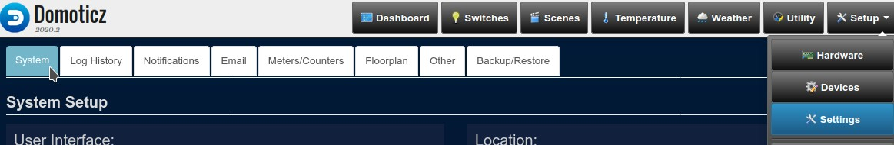

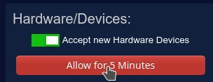

Add the Linky hardware in Domoticz Setup / Hardware configuration tab.

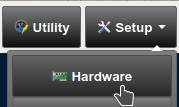

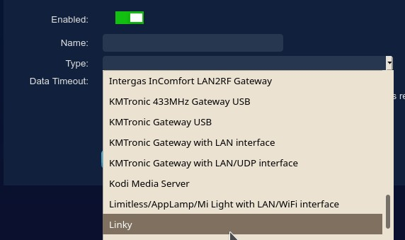

You can configure the peak hour tariffs (Costs T1 for consumption and R1 for production) and off-peak hours (Costs T2 for consumption and R2 for production) in the Setup / Setup / Meters/Counters menu. In this menu, check that "Energy" is set to 1000.

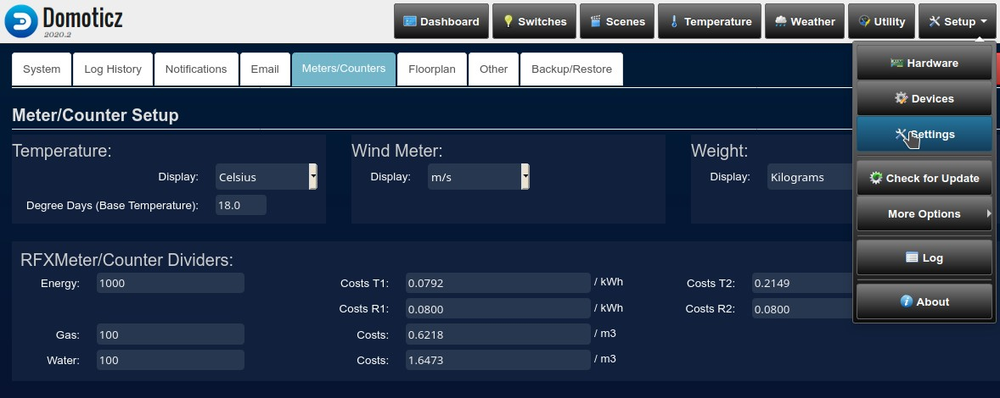

In this same menu, at the bottom, check that "P1 Smart Meter" is indeed of type "With Decimals". 

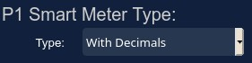

### Give consent
To start, go to "Error" tab in Setup / Log. At first connections, the plugin shall give you the web address https://enedis.domoticz.russandol.pro/device to browse and a code to copy/paste to give Enedis authorizations to share your data with the plugin.

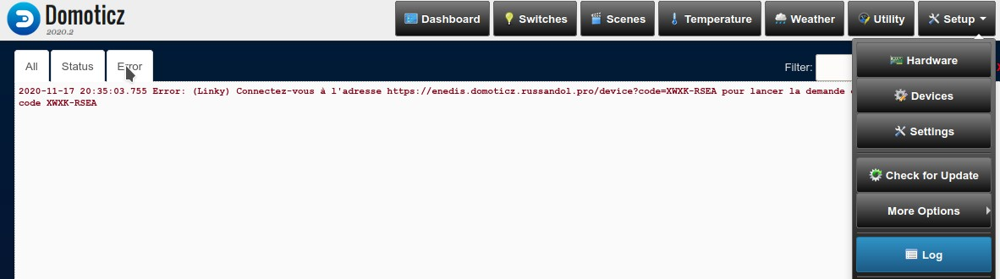

If you don't answer quickly, the plugin will stop. To relaunch the process, go to Setup / Hardware, click on the plugin then on Update.


After enabling the hardware and give authorizations, you shall have a new Linky Utility device and watch your energy consumption history with the Log button.

### Off-peak hours
You can fill in the "Off-peak hours" field to choose the hourly time ranges ("Usage 2" in the curves), or leave blank to deactivate, here are some examples:

```
2:00-7:00 13:00-16:00
```
configures off-peak hours from 2h to 7h and from 13h to 16h.

```
2:00-7:00 13:00-16:00 Wednesday 8:00-15:00 Saturday 09:00-11:00 12:00-16:00
```
configures off-peak hours from 8am to 3pm on Wednesday, from 9am to 11am and from 12pm to 4pm on Saturday and from 2am to 7am and from 1pm at 4pm the other days of the week.

```
2:00-7:00 13:00-16:00 me 08:00-15:00 sat 09:00-16:00
```
configures off-peak hours from 8am to 3pm on Wednesday, from 9am to 4pm on Saturday and from 2am to 7am and from 1pm to 4pm the other days of the week .

```
12345678901234 1:00-6:00 12:00-14:00 88888888888888 13:00-16:00
```
configure the off-peak hours for the time slots "1:00-6:00 12:00-14:00" for the delivery point "12345678901234" and the time slot "13:00-16:00" for the point delivery code "88888888888888".

```
2:00-04:00 16:00-19:00 12345678901234 1:00-6:00 12:00-14:00 Wednesday 11:00-16:00 88888888888888 13:00-16:00
```
configures the off-peak hours for the time slot "11:00-16:00" on Wednesday and "1:00-6:00 12:00-14:00" for the others days of the week for the delivery point "12345678901234", the time slot "13:00-16:00" for the delivery point "88888888888888" and the time slots "02:00-04:00 16:00-19:00" for all the other delivery points.

```
02:00-04:00 16:00-19:00 12345678901234 88888888888888 13:00-16:00
```
disables off-peak hours for the delivery point 12345678901234, configures off-peak hours for the "13:00-16:00" time slot for the "8888888888888888" delivery point and the time slots "02:00-04:00 16:00-19:00" for all other delivery points.

```
02:00-04:00 16:00-19:00 P 17:00-22:00 Wednesday 11:00-16:00 12345678901234 88888888888888 13:00-16:00
```
disables off-peak hours for the delivery point 12345678901234, configures off-peak hours for the "13:00-16:00" time slot for the "8888888888888888" delivery point and the time slots "02:00-04:00 16:00-19:00" for consumption and "11:00-16:00" on Wednesday and "17:00-22:00" for the other days of the week for production for all other delivery points.

```
02:00-04:00 16:00-19:00 P
```
configures the off-peak hours for the time slots "02:00-04:00 16:00-19:00" for consumption and disables off-peak hours for production for all delivery points.

```
02:00-04:00 sa 00:00-23:59 su 00:00-23:59 ba 00:00-23:59
```
configures the off-peak hours for the time slot "02:00-04:00", during the week-end and during bank holidays.

To apply off-peak hours to old data, change the "Debug" setting to "Reset cache" and click "Edit", then put "Debug" back to its old position and do "Update" again.

### Display
You can choose the number you want to see on the dashboard:


* on first line: it is the instant consumption (Watt). This line is linked to "Consommation à montrer sur le tableau de bord (affichage principal)" plugin parameter

* on next lines: it is the energy consumption (kWh). The "Today" value before is always 0, because Enedis provides the value for the day before only. These lines are linked to "Consommation à montrer sur le tableau de bord (affichage secondaire)" plugin parameter. These lines won't appear on main dashboard view tab, only in Utility tab

### Data collect
* You can choose the number of days to collect data for the short log (day). You can set the number of days to collect data for the short log (day) to 0 to disable data grabbing for this view. Note that Domoticz will clean every day data in the short log, based on the Short Log Sensors value the in Setup / Settings / Log History, you can increase the value there to get up to 7 days of short log history.

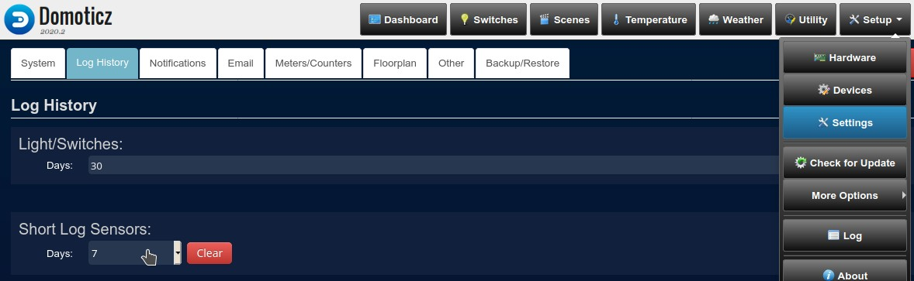

* You can choose the number of days to collect data for week/month/year log. If the value is greater than 35, the plugin will grab data only from time to time or when the value is changed, so as not to overload the Enedis servers. After getting data, they are stored and persist in Domoticz database

## Troubleshooting
### Service Status
First consult the [status of Enedis services (API in production: Authorize and Metering Data v5)](https://datahub-enedis.fr/services-api/etat-des-services/). In case of error, the plugin will not be able to work either, it will be necessary to wait for the restoration of services.

### The curves display the data in days of the week, the month and the year but not the data in hours
Check that you have followed all the steps in the menu [Configuration](#configuration-1).

### "Données manquantes pour mettre à jour le tableau de bord" error
This error is related to missing data to satisfy the "Consommation à montrer sur le tableau de bord" display settings. This error must be transient. If it persists for several days in a row, try changing the "Consommation à montrer sur le tableau de bord" configuration. If this still persists, open a support request.

### "Serveurs inaccessibles à cette heure" error
The Enedis servers are inaccessible at night, the plugin will try to retrieve your data by itself the next morning after 8am.

### "Trop d'échecs de communication, le plugin réessaiera plus tard" error
This generally reflects a quota problem: Enedis gives the plugin a certain number of possible calls to its site for all users of the plugin. The plugin will on its own retry to retrieve your data the next hour. If you often encounter this error, it is better to decrease the "Nombre de jours à récupérer pour les autres vues" parameter to 7 to decrease the number of calls.

### Consent Obtaining Issues
If you have recurring problems with obtaining consent, you can restart the step by changing the "Debug" parameter to "Reset consentement" and click on "Modify", then put "Debug" back to its old position and redo "Modify". Then go back to read the chapter [Give consent](#give-consent).

### Problems persist
Change the "Debug" parameter to "Simple" and click on "Modify". Observe the Domoticz log, it will show you the path to a plugin specific log file, for example /tmp/DomoticzLinky_2021_01_17_15_04_19_ukzvik3k.log. Open this file with a text editor to see what's going on. If you don't understand it, send the file to the email address that appears at https://github.com/guillaumezin (for the address to be visible, you must have a github account and you must be logged in) and at the same time open a support ticket on https://github.com/guillaumezin/DomoticzLinky/issues. Do not try to attach the log file to the support ticket, it will not work.

## Authors
* **Baptiste Candellier** - *Kindle Linky plugin* - [linkindle](https://github.com/outadoc/linkindle)
* **Asdepique777** - *Jeedom Linky plugin* - [jeedom_linky](https://github.com/Asdepique777/jeedom_linky)
* **epierre** - *Linky external script for Domoticz* - [domoticz_linky](https://github.com/empierre/domoticz_linky)
* **Guillaume Zin** - *Port to Domoticz plugin framework and adaptation of Device Flow Proxy Server code for Enedis* - [DomoticzLinky](https://github.com/guillaumezin/DomoticzLinky) and [DomoticzFlowProxyServer](https://github.com/guillaumezin/Device-Flow-Proxy-Server)
* **Frédéric Caillet** - *Contracting, maintenance and hosting of Device Flow Proxy Server code for Enedis* - [DomoticzFlowProxyServer](https://github.com/russandol-sarl/Device-Flow-Proxy-Server)

See also the list of [contributors](https://github.com/guillaumezin/DomoticzLinky/contributors) who participated in this project.

## License
This project is licensed under the AGPLv3 license - see the [LICENSE](LICENSE) file for details.

## Acknowledgments
* Frédéric Caillet - his web site: [RUSSANDOL](https://www.russandol.pro) - for the web hosting and maintenance of the oAuth consent middleware infrastructure and contracting with Enedis 
* Baptiste Candellier
* Asdepique777
* empierre
* Domoticz team
